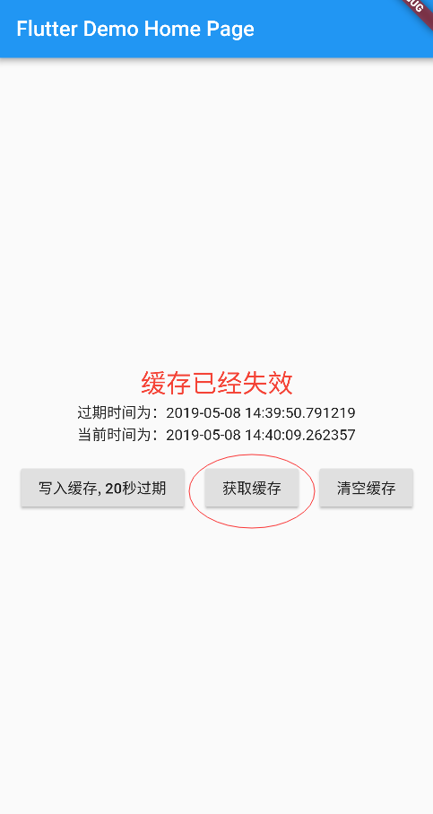

# simple_cache

A flutter plugin for cache, simple and extendible

## Usage:

### Add dependency：
Please check the latest version before installation.
```
dependencies:
  flutter:
    sdk: flutter
  # add simple_cache
  simple_cache: ^0.0.3
```

### Add the following imports to your Dart code:
```
import 'package:simple_cache/simple_cache.dart';
```

### How to use

```dart
/// set cache
void setExCache() async{
     String cacheKey = 'simple.cache.key';
     String value = 'simple cache value';
     SimpleCache simpleCache = await SimpleCache.getInstance();
     await simpleCache.setEx(cacheKey, value, expire:  expire);
}

/// get cache
String getExCache(){
    String cacheKey = 'simple.cache.key';
    SimpleCache simpleCache = SimpleCache.getInstance();
    return simpleCache.getEx(cacheKey);
}

/// set map
void setMapCache() async{
     String cacheKey = 'simple.map.cache.key';
     Map value = {
         'id': 1,
         'name': 'simple cache',
     };
     SimpleCache simpleCache = await SimpleCache.getInstance();
     await simpleCache.setMap(cacheKey, value);
}

/// get map
Map getMapCache(){
     String cacheKey = 'simple.map.cache.key';
     SimpleCache simpleCache = SimpleCache.getInstance();
     return simpleCache.getMap(cacheKey);
}

/// set list map
void setListMapCache() async{
     String cacheKey = 'simple.list.map.cache.key';
     List<Map> value = [
         {
            'id': 1,
            'name': 'simple cache',
         }
     ];
     SimpleCache simpleCache = await SimpleCache.getInstance();
     await simpleCache.setMap(cacheKey, value);
}

/// get list map
List<Map> getListMapCache(){
     String cacheKey = 'simple.list.map.cache.key';
     SimpleCache simpleCache = SimpleCache.getInstance();
     return simpleCache.setListMap(cacheKey);
}
```

### example:

[example demo](/example/lib/main.dart)
 
effect:


